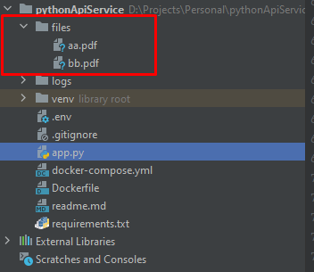

## How to run this service

1. copy all files except _`venv`_ folder to server
2. run ``docker build -t pythonapiservice . ``
3. run ``docker-compose build``
4. run ``docker-compose up``
5. Enjoy

## .env file example

```
SMTP_SERVER=smtp.hostinger.com
SMTP_PORT=465
SMTP_USERNAME=example.com
SMTP_PASSWORD=password
```

## Request examples

CURS could be found in **`app.py`** file

## Very important

Do not forget to put necessary files inside file folder with correct names! And update **`app.py`** file with correct
filenames


